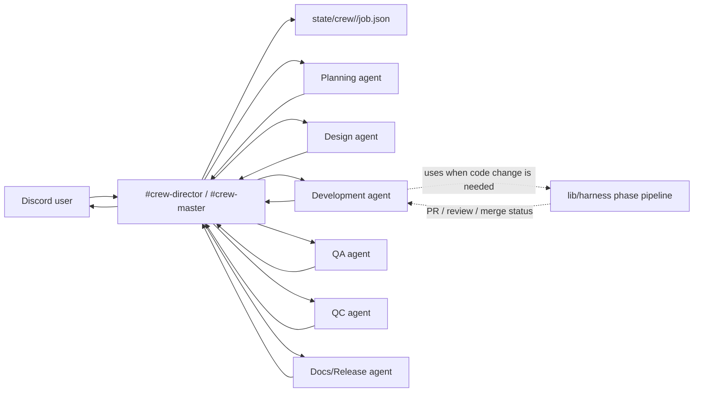

# Discord Multi-Agent Orchestration

**Status**: Product architecture baseline (2026-04-29)

This document is the canonical product direction for crewai. The user-facing
service is Discord-first multi-agent collaboration. The harness is an internal
developer workflow used by agents when code work needs durable git/PR handling;
it is not the product surface.

If this document conflicts with older harness-first wording, this document,
ADR-0006, and ADR-0007 win.

Operational follow-up is tracked in `docs/discord/FOLLOW_UP.md`.

## Product Goal

A user gives work to a Discord Director. The Director breaks the work into
role-specific tasks, dispatches those tasks to specialist AI agents, tracks the
state of the job, collects results, asks for revisions when needed, and returns
the final outcome in Discord.

The collaboration loop must be visible and operable from Discord:

- intake and clarification
- task decomposition
- worker dispatch
- worker results
- review and revision
- QA/QC sign-off
- final delivery

## Runtime Model



## Roles

The first production roster should cover these roles. Role names are product
concepts; backing CLIs can be Codex, Claude Code, or another agent runtime.

| Role | Responsibility | Typical output |
|---|---|---|
| `director` | Owns job orchestration, routing, status, and final delivery | task graph, assignments, final response |
| `planner` | Converts user intent into execution plan and acceptance criteria | scoped plan, milestones, risks |
| `developer` | Implements code changes or technical artifacts | patch, PR, implementation notes |
| `designer` | Produces UX/product design decisions and assets/specs | UX flow, UI spec, design review |
| `qa` | Verifies behavior against acceptance criteria | test plan, bug list, pass/fail report |
| `qc` | Checks output quality, completeness, and delivery readiness | release gate verdict |
| `critic` | Adversarial review for correctness and edge cases | blocking issues, remediation |
| `docs-release` | Turns finished work into user-facing docs/release notes | changelog, runbook, handoff notes |

Existing `codex-critic`, `claude-coder`, and `codex-ue-expert` are early
specialized workers. They should be moved under this broader roster instead of
remaining the whole product model.

## Discord Surfaces

The service should keep the user inside Discord.

- `#crew-director` or current `#crew-master`: user intake, dispatch receipts,
  status summaries, approval questions, final delivery.
- Worker channels: role-specific detailed work and raw outputs.
- Optional thread per job: long-running job transcript, artifacts, and revision
  history.

The Director must back-post worker completion summaries to the Director channel
so the user does not have to manually poll worker channels.

## Discord Bot Accounts

Production orchestration requires multiple Discord bot identities. A single bot
can move messages, but it cannot clearly represent Director, Codex-backed
workers, and Claude-backed workers as separate collaboration actors.

Required OpenClaw Discord account ids:

- `crewai-bot` - Director intake, job status, approval questions, final
  delivery, and worker completion summaries in the Director channel.
- `codexai-bot` - Codex-backed specialist worker outputs: planner, designer,
  QA, QC, critic, UE expert, and docs/release.
- `claudeai-bot` - Claude-backed developer output.

`crew/agents.json` maps each agent to a `discord_account_id`.
`lib/crew/dispatch.py` passes that value to
`openclaw message send --account <account-id>`, so the posted Discord identity
comes from configuration instead of from hardcoded channel logic.

Bot tokens and Discord application secrets are deployment secrets. They must not
be committed to the repo. Each bot needs the required guild/channel membership,
send/read permissions, and Discord Gateway intents for the channels it serves.

## Job State

Add a crew-level state machine separate from harness state:

```text
state/crew/<job-id>/
  job.json
  transcript.md
  artifacts/
```

Minimum `job.json` shape:

```json
{
  "job_id": "20260429-001-user-slug",
  "status": "intake|planning|dispatching|working|reviewing|qa|qc|delivered|failed",
  "user_request": "...",
  "director_channel_id": "...",
  "created_at": "...",
  "updated_at": "...",
  "tasks": [
    {
      "task_id": "T1",
      "role": "planner",
      "worker": "planner",
      "status": "pending|running|completed|failed|blocked",
      "prompt": "...",
      "result_path": "artifacts/T1.md",
      "depends_on": []
    }
  ],
  "director_plan": {
    "mode": "deterministic",
    "roles": ["planner", "developer", "qa", "qc"]
  },
  "final_result_path": "artifacts/final.md"
}
```

The state is for orchestration, not for hiding conversation. Discord remains
the visible operating surface; state lets the Director resume, summarize, and
avoid losing long-running work.

## Dispatcher Contract

The current dispatcher is a local reliability layer under the Discord product
surface. Productization requires keeping these guarantees stable across both
local recovery and Discord delivery:

- config-driven roster instead of worker names embedded in `SKILL.md` and shell
- per-worker busy locks
- `depends_on` ordering for job-backed tasks
- dependency artifact handoff into downstream worker prompts
- timeout markers and retry policy
- result callback/back-post into Director channel
- full output storage in `state/crew/<job-id>/artifacts/`
- safe reset per worker and per job

Local Director decomposition is available before Discord channel integration:

```bash
python3 lib/crew/director.py --request "..."
python3 lib/crew/director.py --request "..." --role planner --role developer --role qa --role qc
```

The Director CLI creates `pending` tasks in canonical order and records a
`director_plan` block. Defaults are `planner → developer → qa → qc`; request
keywords can add `designer`, `critic`, `ue-expert`, or `docs-release`.
`depends_on` is enforced locally: `lib/crew/dispatch.py --task-from-job` refuses
to run a task until all listed dependencies are `completed`, and it appends the
completed dependency artifacts to the worker prompt so context flows from plan
to implementation to QA/QC. `lib/crew/sweep.py` marks rows as `ready` or shows
the blocking dependency in `blocked_by`; when all tasks are complete, it points
the operator at `lib/crew/finalize.py`.

Proposed config file:

```text
crew/agents.json
```

`crew/agents.example.json` is the first concrete draft of that shape. Runtime
deployments should copy it to a local, channel-specific config and replace
`TODO_*_CHANNEL_ID` values.

The config should map role names to:

- Discord worker channel ID
- OpenClaw Discord account ID / bot identity
- backing CLI/runtime
- working directory
- persona file
- timeout
- whether the worker may invoke harness

## Harness Boundary

Harness remains valuable, but only inside the development worker path.

Use harness when:

- a code change needs a branch, commit, PR, CodeRabbit handling, or merge gate
- a developer worker needs repeatable plan/impl/commit phases
- QA/QC needs reproducible evidence from tests or PR checks

Do not expose harness phases as the primary user workflow. The Director should
translate harness results into Discord-level status such as:

- "implementation PR opened"
- "CodeRabbit review received"
- "minor review feedback applied"
- "QA failed: 2 issues"
- "QC approved for delivery"

## Delivery Gate

Final delivery must pass a local QA/QC gate before the Director marks a job
`delivered`.

ADR-0007 records why these local controls exist under the Discord-facing
product surface.

```bash
python3 lib/crew/gate.py <job-id>
python3 lib/crew/gate.py <job-id> --require-final-result
python3 lib/crew/gate.py <job-id> --json
python3 lib/crew/finalize.py <job-id>
```

Initial gate rules are deliberately conservative:

- every task in `job.json` must be `completed`
- at least one `qa` task must be `completed`
- at least one `qc` task must be `completed`
- any `pending`, `running`, `failed`, or `blocked` task blocks delivery
- `--require-final-result` additionally requires `final_result_path` to point
  at an existing file under the job directory unless the path is absolute

`lib/crew/finalize.py` is the local closeout path. It writes
`artifacts/final.md` from completed worker artifacts, stores
`final_result_path`, re-checks the delivery gate with final-result enforcement,
and marks the job `delivered` when the gate is clean.

## Implementation Sequence

1. Define `crew/agents.json` roster and add missing product personas. **Initial
   scaffold complete** via `crew/agents.example.json` and product personas.
2. Replace hardcoded roster in `crew-master` / `crew-dispatch.sh` with config
   lookup for the broader product roster. **Initial implementation complete**
   via `lib/crew/config.py` + `lib/crew/dispatch.py`; deployments still need a
   real local `crew/agents.json`.
3. Add `state/crew/<job-id>/job.json` helpers and a sweep/resume command.
   **Initial implementation complete** via `lib/crew/state.py` and
   `lib/crew/sweep.py`.
4. Add Director back-post summaries on worker completion. **Initial helper path
   complete** in `lib/crew/dispatch.py`.
5. Add busy/queue handling per worker. **Initial implementation complete** via
   per-worker lock files and `--busy-policy {fail,wait,none}` in
   `lib/crew/dispatch.py`; queue semantics are `wait`-based for now.
6. Add QA/QC delivery gate. **Initial implementation complete** via
   `lib/crew/gate.py`.
7. Add Director task decomposition. **Initial implementation complete** via
   `lib/crew/director.py` deterministic local planner.
8. Enforce dispatch dependency ordering and pass dependency artifacts to
   downstream workers. **Initial implementation complete** via
   `lib/crew/state.py`, `lib/crew/dispatch.py`, and `lib/crew/sweep.py`.
9. Add lifecycle status refresh and final-result closeout. **Initial
   implementation complete** via `lib/crew/state.py`, `lib/crew/dispatch.py`,
   `lib/crew/sweep.py`, and `lib/crew/finalize.py`.
10. Add multi-bot Discord account routing. **Initial implementation complete**
   via `discord_account_id` in `crew/agents.example.json`, account discovery in
   `lib/crew/config.py`, and `openclaw message send --account` in
   `lib/crew/dispatch.py`.
11. Add Discord smoke tests for the complete user-visible loop after channel
   account setup. **Tracked** in `docs/discord/FOLLOW_UP.md`.
12. Add harness handoff only for developer tasks that require code/PR work.

## Acceptance Criteria

The product is not ready until all of these are true:

- A user can submit one job in Discord and receive a Director-generated task
  breakdown.
- At least three specialist agents can work on the same job and report results.
- Director, Codex-backed workers, and Claude-backed workers post through their
  configured bot identities.
- The Director can summarize partial progress without manual channel polling.
- QA and QC can block final delivery.
- The final answer appears in Discord with links or references to worker outputs.
- A crashed or timed-out worker leaves recoverable job state.
