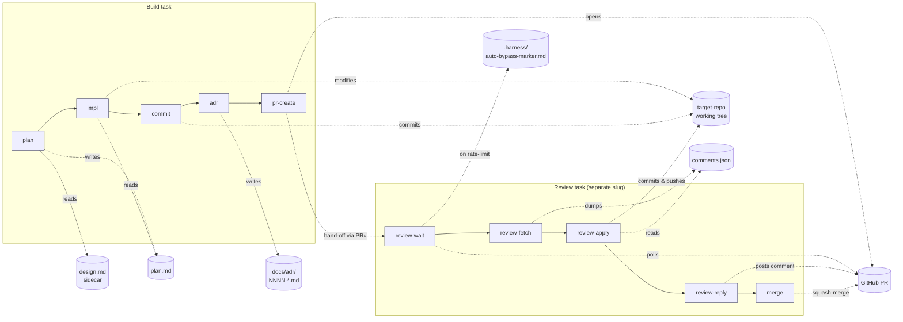
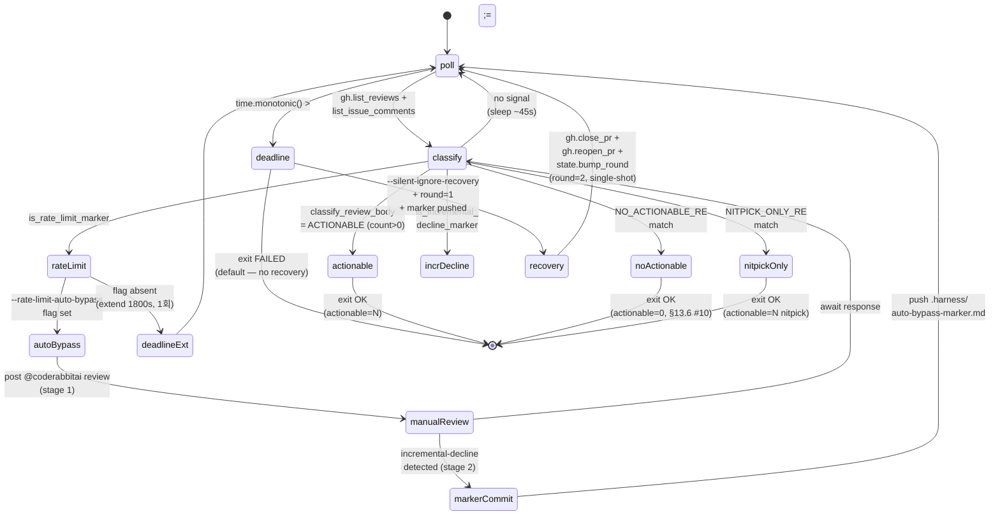
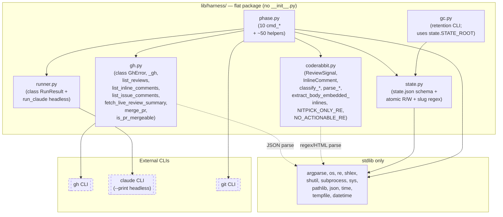

# Harness architecture — visualization cheatsheet

> **본 문서는 시각화용 보조 자료**. 단일 진원지(canonical as-built)는 `DESIGN.md` §14.
> 두 문서가 충돌하면 §14가 옳고, 본 문서를 동기화한다. 본 문서의 6개 다이어그램은
> 2026-04-25 기준 소스 코드(`lib/harness/*.py`, `skills/crewai-debate-harness/SKILL.md`)
> 에 직접 grounded. 모든 다이어그램은 GitHub-flavored Mermaid.

목차:
1. [System overview — Two-track + 외부 의존성](#1-system-overview)
2. [Harness 10-phase pipeline + state contract](#2-harness-10-phase-pipeline)
3. [review-wait classification state machine](#3-review-wait-classification)
4. [`state.json` schema — implement-task vs review-task](#4-statejson-schema)
5. [Debate-harness bridge sequence](#5-debate-harness-bridge-sequence)
6. [Module dependency graph — `lib/harness/`](#6-module-dependency-graph)

---

## 1. System overview

**Two cooperating tracks** (Debate + Harness) sharing low-level assets, plus
GitHub/CodeRabbit/claude-CLI as external dependencies. Discord is the only
delivery surface that **drops trailing tool calls** — so `crewai-debate-harness`
(which writes a sidecar via Bash after the debate) is terminal-only by design.

```mermaid
flowchart TB
  subgraph Operator["Operator surface"]
    CLI["phase.py CLI<br/>(plan/impl/commit/adr/<br/>pr-create/review-*/merge)"]
    GC["gc.py CLI<br/>(state retention)"]
    Discord["Discord channel<br/>(crewai-debate v3)"]
    Terminal["Terminal/MCP<br/>(crewai-debate-harness)"]
  end

  subgraph Skills["skills/"]
    SD["crewai-debate/<br/>SKILL.md"]
    SDH["crewai-debate-harness/<br/>SKILL.md"]
    SC["crew-master/<br/>SKILL.md"]
    SH["hello-debate/<br/>SKILL.md"]
  end

  subgraph Personas["crew/personas/"]
    P1["planner.md"]
    P2["implementer.md"]
    P3["adr-writer.md"]
    P4["coder/critic/<br/>ue-expert.md"]
  end

  subgraph Harness["lib/harness/"]
    PH["phase.py<br/>(~85k, 10 cmd_*)"]
    ST["state.py<br/>(state.json schema)"]
    CR["coderabbit.py<br/>(review classifier +<br/>body-embedded parser)"]
    GH["gh.py<br/>(PR/review API wrapper)"]
    RN["runner.py<br/>(claude headless<br/>invoker)"]
    GCM["gc.py<br/>(retention policy)"]
  end

  subgraph StateFS["state/harness/&lt;slug&gt;/<br/>(gitignored)"]
    SJ["state.json"]
    PM["plan.md"]
    DM["design.md<br/>(sidecar)"]
    LOG["logs/*-N.log"]
    CJ["comments.json"]
  end

  subgraph External["External services"]
    GHAPI["GitHub API<br/>(gh CLI)"]
    CRBOT["CodeRabbit bot<br/>(reviews/comments)"]
    CL["claude CLI<br/>(headless --print)"]
  end

  Discord --> SD
  Terminal --> SDH
  Terminal --> SC
  Terminal --> SH

  CLI --> PH
  GC --> GCM
  SDH -.writes design.md.-> DM

  PH --> ST
  PH --> CR
  PH --> GH
  PH --> RN
  PH --> P1 & P2 & P3
  ST --> SJ & PM & DM & LOG & CJ
  GCM --> SJ

  GH --> GHAPI
  RN --> CL
  GHAPI -. CodeRabbit posts .- CRBOT
```

---

## 2. Harness 10-phase pipeline

두 task type의 phase 분리:

- **Implement task**: `plan → impl → commit → adr? → pr-create` (5 phases, `adr` optional).
- **Review task**: `review-wait → review-fetch → review-apply → review-reply → merge` (5 phases). 별도 slug, 별도 `state.json`.

각 phase는 `state.py::start_attempt`로 attempt 슬롯을 append, 완료 시 `set_phase_status(completed)`. `_require_prev_phase_completed`가 직전 phase 완료를 강제 — 멱등 재시도 + 명시적 순서. 외부 repo 운영을 위해 **`plan` / `impl` / `pr-create` 진입 시 `_require_feature_branch` fail-fast** — HEAD가 `main`/`master`이면 즉시 fatal (§13.6 #14 fix, PR #54).



---

## 3. review-wait classification

`review-wait`는 단일 phase지만 가장 복잡한 상태 머신. CodeRabbit 응답 형태가
세 분기로 수렴 (full review / issue comment / silent ignore) — `coderabbit.py`의
classifier 4종이 모든 진입을 흡수.



핵심 통찰 (PR #49 gen-12 + PR #50 gen-13 + PR #52 gen-15 검증):
- §13.6 #10/#11/#12 핸들러가 모두 terminal state로 흡수.
- "marker file → eventual zero-actionable" 합성 경로가 `markerCommit → poll → noActionable → exit`로 정확히 매핑.
- **§13.6 #13 silent-ignore 시나리오** (CodeRabbit hourly bucket 소진) production 확정 (PR #50/#52). 운영자 수동 close+reopen → bump_round → 재폴 → 정상 종결로 회복 검증.
- **§13.6 #13 fix candidate (c) automation**: `--silent-ignore-recovery` opt-in 플래그가 round-1 timeout + marker 푸시 상태에서 자동 close+reopen + bump_round + recurse. 그림의 `deadline → recovery → poll` 분기. round=1 single-shot 가드로 round-2 timeout은 그대로 fatal.

---

## 4. `state.json` schema

두 task type의 schema는 공유 부분(`task_slug`, `current_phase`, `phases.*.status`)과
type-specific 부분이 명확히 분리. atomic write는 `tempfile + os.replace`,
slug regex는 `^[A-Za-z0-9][A-Za-z0-9._-]{0,127}$`로 path-traversal 차단.

```mermaid
classDiagram
  class State_ImplementTask {
    +task_slug: str
    +task_type = "implement"
    +intent: str
    +target_repo: abs_path
    +created_at: iso8601
    +updated_at: iso8601
    +current_phase: str
    +commit_sha: str | None
    +pr_number: int | None
    +pr_url: str | None
    +phases: ImplementPhases
  }
  class ImplementPhases {
    +plan: PhaseSlot
    +impl: PhaseSlot
    +commit: PhaseSlot
    +pr-create: PhaseSlot
    +adr?: PhaseSlot   ## ensure_phase_slot
  }
  class PhaseSlot {
    +status: pending|running|completed|failed
    +attempts: Attempt[]
    +final_output_path: str | None
  }
  class Attempt {
    +idx: int
    +started_at: iso8601
    +finished_at: iso8601 | null
    +exit_code: int | null
    +log_path: str
    +note: str | null
  }
  State_ImplementTask --> ImplementPhases
  ImplementPhases --> PhaseSlot
  PhaseSlot --> Attempt

  class State_ReviewTask {
    +task_slug: str
    +task_type = "review"
    +base_repo: owner/repo
    +pr_number: int
    +target_repo: abs_path
    +head_branch: str | None
    +round: int
    +created_at / updated_at: iso8601
    +current_phase: str
    +seen_review_id_max: int | null
    +seen_issue_comment_id_max: int | null
    +phases: ReviewPhases
  }
  class ReviewPhases {
    +review-wait: ReviewWaitSlot
    +review-fetch: ReviewFetchSlot
    +review-apply: ReviewApplySlot
    +review-reply: ReviewReplySlot
    +merge: MergeSlot
  }
  class ReviewWaitSlot {
    +status, attempts[]
    +review_id: int | null
    +review_sha: str | null
    +actionable_count: int | null
    +auto_bypass_manual_attempted: bool
    +auto_bypass_commit_pushed: bool
  }
  class ReviewFetchSlot {
    +status, attempts[]
    +comments_path: str | null
  }
  class ReviewApplySlot {
    +status, attempts[]
    +applied_commits: sha[]
    +skipped_comment_ids: list[{id, reason}]
  }
  class ReviewReplySlot {
    +status, attempts[]
    +posted_comment_id: int | null
  }
  class MergeSlot {
    +status, attempts[]
    +merge_sha: sha | null
    +dry_run: bool
  }

  State_ReviewTask --> ReviewPhases
  ReviewPhases --> ReviewWaitSlot
  ReviewPhases --> ReviewFetchSlot
  ReviewPhases --> ReviewApplySlot
  ReviewPhases --> ReviewReplySlot
  ReviewPhases --> MergeSlot
```

핵심 invariants:
- `seen_review_id_max` / `seen_issue_comment_id_max`은 **monotone watermark** — `bump_round`가 round-scoped 필드만 reset, watermark는 round 간 보존 (§13.6 #7-7).
- `auto_bypass_manual_attempted` / `auto_bypass_commit_pushed`는 round당 1회 fire — `bump_round`에서 둘 다 false로 reset.
- `MergeSlot.dry_run + merge_sha` 조합이 re-run 가드: 진짜 머지(`dry_run=False` ∨ `merge_sha` set)만 fatal-exit, dry-run은 overwrite 허용 (ADR-0002).

---

## 5. Debate-harness bridge sequence

ADR-0003의 핵심 계약 시각화: **operator의 debate 승인이 1-line `--intent` 채널을
우회해 sidecar로 그대로 전달**. Model A의 5/8 divergence가 0/8로 수렴하는 이유.

```mermaid
sequenceDiagram
  autonumber
  actor Op as Operator
  participant Skill as crewai-debate-harness<br/>SKILL.md
  participant LLM as Claude (in-turn)<br/>Dev↔Reviewer roles
  participant FS as state/harness/<br/>&lt;slug&gt;/
  participant Plan as phase.py cmd_plan
  participant Persona as crew/personas/<br/>planner.md
  participant Cl as claude headless<br/>(runner.run_claude)

  Op->>Skill: "debate-harness: <slug>: <topic>"<br/>[+ auto-plan: yes, intent=, target=]
  Note over Skill: Pre-checks:<br/>- Discord? abort<br/>- slug valid? topic real?<br/>- existing design.md? refuse
  Skill->>LLM: enter Developer frame
  LLM-->>Skill: "### Developer — iter 1"
  Skill->>LLM: enter Reviewer frame
  LLM-->>Skill: "### Reviewer — iter 1"
  Note over Skill,LLM: loop until APPROVED<br/>or max_iter=6
  Skill-->>Op: emit transcript<br/>+ === crewai-debate result === block

  Skill->>FS: Bash: write design.md<br/>(FINAL_DRAFT + verdict + history)
  FS-->>Skill: abs path
  Skill-->>Op: "bridge: design.md written → <path>"

  alt auto-plan: yes
    Skill->>Plan: Bash: phase.py plan <slug><br/>--intent ... --target-repo ...
    Plan->>FS: _read_design_sidecar(slug)<br/>= state.task_dir(slug)/design.md
    FS-->>Plan: design.md contents (str)
    Plan->>Persona: read planner.md
    Plan->>Cl: prompt = persona<br/>+ "## Approved design context<br/>(do not deviate)" header<br/>+ design.md body<br/>+ "# Task" section
    Cl-->>Plan: plan.md output
    Plan->>FS: write plan.md +<br/>state.json (phase=plan/completed)
    Plan-->>Skill: stderr: "plan: design.md<br/>sidecar detected (N chars)..."
    Skill-->>Op: "bridge: plan completed →<br/>state/harness/<slug>/plan.md"
  else default (no auto-plan)
    Note over Op: operator runs<br/>phase.py plan manually
  end
```

운영 제약:
- **Discord 금지**: skill의 trailing Bash 호출이 OpenClaw delivery layer에 의해 drop됨. 터미널/Claude Code/MCP 컨텍스트 전용.
- **`design.md` 사전 존재 시 abort**: 같은 slug 재실행 시 이전 승인을 silently overwrite하지 않음 (`bridge: refused — design.md already exists`).
- **Auto-plan 체인은 plan에서 정지**: impl/commit/pr-create는 부작용이 크므로 operator가 plan.md 검토 후 진행.

---

## 6. Module dependency graph

`lib/harness/`는 `__init__.py` 없는 flat 패키지 (직접 `python3 lib/harness/<file>.py`
실행). DAG 무순환 — `phase`만 orchestrator, 나머지 helper module은 서로 의존
안 함. 외부 CLI 3종 (`gh`, `claude`, `git`)이 의존성 경계.



설계 특성:
- **DAG 무순환**: `state` ↔ `runner` ↔ `coderabbit` ↔ `gh`는 서로 import 안 함, 모두 `phase`가 orchestrator.
- **`gc.py`는 `state.py`만 읽음** — runner/gh/coderabbit과 분리되어 manual CLI가 hot-path 부작용 없이 안전 (ADR-0001).
- **stdlib only** — 하네스 자체에는 third-party 의존성 없음.
- **모듈 규모 (참고)**: `phase.py`가 오케스트레이터로 가장 크고, `coderabbit.py`/`state.py`/`gh.py`가 핵심 보조 모듈이며, `gc.py`/`runner.py`는 상대적으로 작다.

---

## 동기화 정책

- 본 문서는 **시각화 cheatsheet** — DESIGN.md §14가 단일 진원지.
- 충돌 시 §14를 따른다.
- 코드 변경이 phase 카탈로그/state schema/module 경계에 영향 시: §14 갱신과 함께
  본 문서의 해당 다이어그램만 동기화 (전체 재작성 금지).
- 신규 다이어그램 추가는 PR로 제안 — DESIGN/RUNBOOK과의 cross-reference도 함께.
